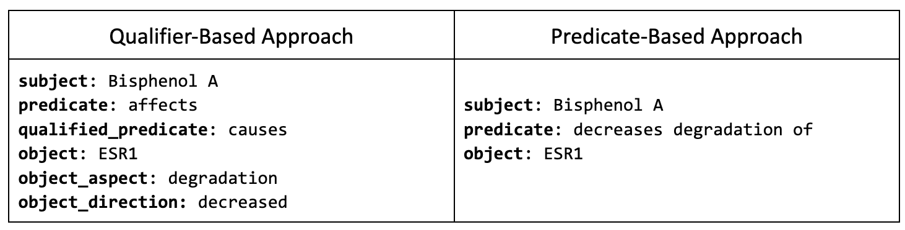
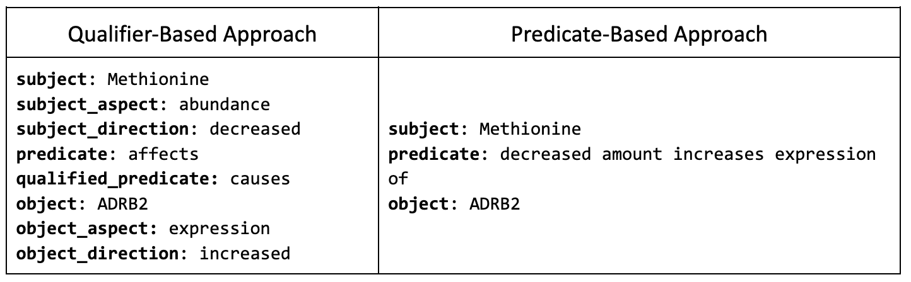

## Biolink 3.0 Qualifiers Examples

### Object qualifiers
_“Bisphenol A results in decreased degradation of ESR1 protein”_

* [object_qualifiers.json](object_qualifiers.json)

### Subject and object qualifiers
_“Methionine deficiency results in increased expression of ADRB2”_

* [subject_and_object_qualifiers.json](subject_and_object_qualifiers.json)

### Complex GO-CAM statement
_"The protein ser/thr kinase activator activity of Ras85D in the plasma membrane directly positively regulates MAPKKK 
activity of Raf in the cytoplasm within the EGFR signaling pathway"_

* [complex_gocam_qualifiers.json](complex_gocam_qualifiers.json)

### Qualifier Rules

These rules can not be enforced in the schema for TRAPI, but should be implemented in a validation layer.

1. __general rules__
   1. There may only be one of each type of qualifier in any edges.qualifier_constraints.qualifier_set
   2. If a KP receives non-empty QEdge.qualifier_constraints, it MUST only return edges that satisfy the entire set of 
   qualifier_constraints. If a KP does not yet support QEdge.qualifier_constraints, it MUST return an empty response 
   because no matches are found.
      1. If a knowledge statement contains more qualifiers or differently typed qualifiers than those specified in
      edges.qualifier_constraints.qualifier_set in addition to the entire set of qualifier_constraints, the knowledge 
      statement MAY also be returned.
2. __qualifier_value__  
   1. is constrained by either: an enumeration in biolink, or an ontology term.  
      1. When an ontology term is used, the assumption is that annotations that use this term or any of its children 
      should be returned.
      2. When an enumerated value is used, the assumption is that annotations that use this enumerated value or any 
      of its children should be returned. 
         1. For example, if a query asks for "biolink:object_aspect_qualifier" = "abundance", 
         then, aspects matching any child of "abundance" should also be returned (if the other qualifiers used in this
         query are also satisfied). 
3. __qualified_predicate__ is required in any edges.qualifier_constraints.qualifier_set.  
   1. If the statement does not make use of a more or less specific value for the qualified_predicate, the value of 
   qualified_predicate should be the predicate.